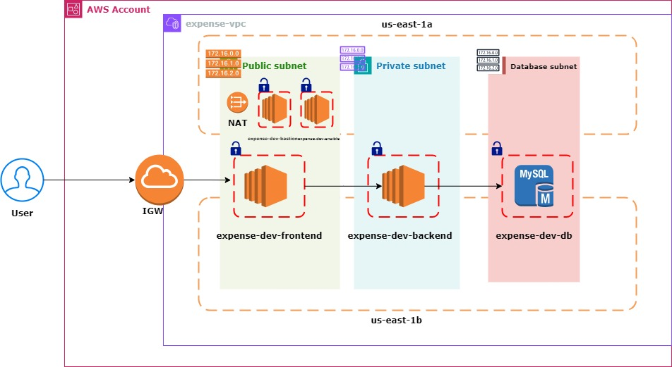
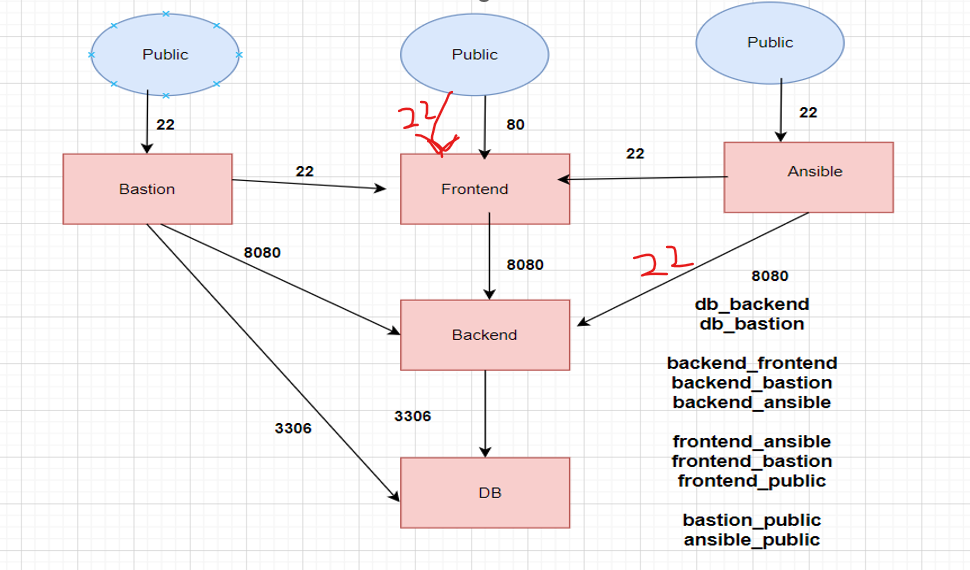

# How to remove unnecessary files:
```
for d in 01-vpc/ 02-sg/ 03-bastion/ 04-mysql/ 05-backend/ 06-frontend/  ; do
  echo "Removing from $d:"
  echo "  $d/.terraform"
  echo "  $d/.terraform.lock.hcl"

  rm -rf "$d/.terraform" "$d/.terraform.lock.hcl"

  echo "Deleted files from $d"
done
```


# Expense Architecture





Note: We are not using VPC Peering here

```
for i in 01-vpc/ 02-sg/ 03-bastion/ 04-mysql/ 05-backend/ 06-frontend/ ; do cd $i; terraform init ; cd .. ; done 
```

```
for i in 01-vpc/ 02-sg/ 03-bastion/ 04-mysql/ 05-backend/ 06-frontend/ ; do cd $i; terraform plan; cd .. ; done 
```

```
for i in 01-vpc/ 02-sg/ 03-bastion/ 04-mysql/ 05-backend/ 06-frontend/ ; do cd $i; terraform apply -auto-approve; cd .. ; done 
```

```
for i in  06-frontend/ 05-backend/ 04-mysql/ 03-bastion/ 02-sg/ 01-vpc/ ; do cd $i; terraform destroy -auto-approve; cd .. ; done 
```

# Login into mysql server and troubleshoot the data.
```
mysql -h db.lithesh.shop -u root -pExpenseApp@1
```

```
use transactions;
```

```
select * from transactions;
```
